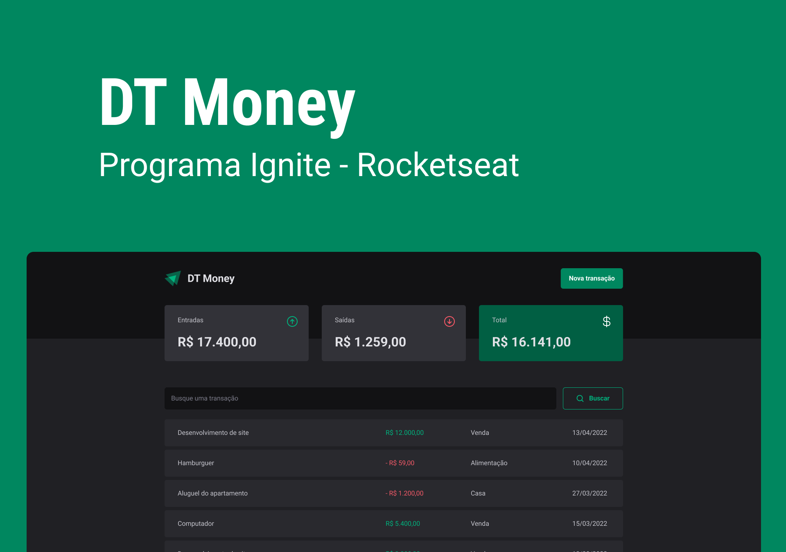

Aplicação desenvolvida como desafio da trilha Ignite da [RockeatSeat](https://rocketseat.com.br/?utm_source=aluno&utm_medium=germano-ricardi&utm_campaign=dev_fullstack).

Veja a aplicação em produção:
[https://germano-ricardi-dt-money.vercel.app](https://germano-ricardi-dt-money.vercel.app)

## Descrição  

Aplicação financeira com controle de entrada e saída, recursos disponíveis:
*   Lançamento de entrada ou saída
*   Histórico de movimentações
*   Filtro no histórico
*   Totalizadores de entrada, saida e valor total

Apesar de serem poucas as funcionalidades, foram aplicados conceitos como:
*   Componentes
*   Axios
*   Utilização de reduce para cálculo dos valores
*   Hooks

## Tecnologias utilizadas

* [x] [NodeJS](https://nodejs.org/en)
* [x] [React](https://reactjs.org)
* [x] [Yarn](https://yarnpkg.com)
* [x] [TypeScript](https://www.typescriptlang.org)
* [x] [JSON Server](https://www.npmjs.com/package/json-server)

## Quickstart
Clone o repositório:
```sh
$  git clone https://github.com/germanoricardi/rocketseat-ignite-003-dt-money
```

Renomeie o arquivo **.env.local.example** para **.env.local**
*   Altere a variável **VITE_API_URL** para a url da sua api, por exemplo: http://localhost:3333
*   Ao setar valor na variável **VITE_API_URL** os lançamentos e consultas serão feitas em sua api, caso o valor ficar vazio todo o controle será feito via **Context API**

Para executar a aplicação utilize os seguintes comandos na raiz da aplicação:
```sh
$  yarn install
$  yarn dev
```

Rode o comando abaixo em outra instância do terminal para levantar o JSON Server em paralelo a aplicação principal (Não esqueça de informar o valor da variável **VITE_API_URL**):
```sh
$  yarn dev:server
```